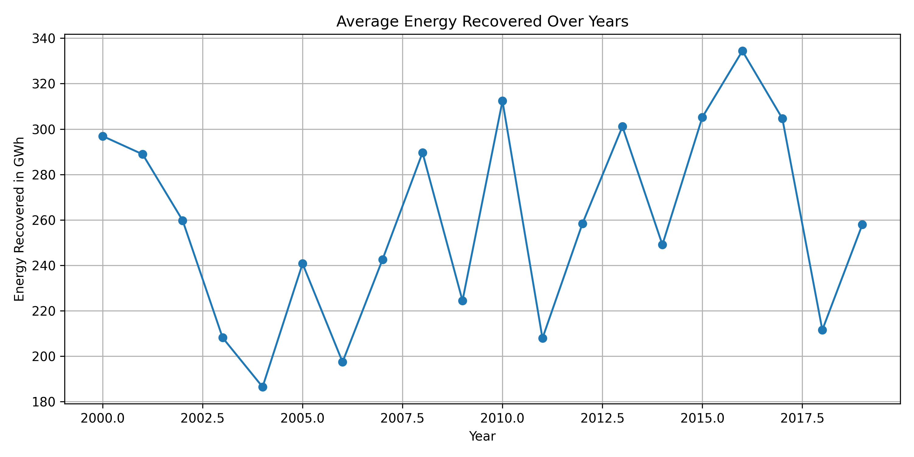

# 🌍 Global Pollution Analysis and Energy Recovery System

## 🧠 Pollution Reduction & Energy Recovery Prediction using Machine Learning

---

## 👤 Author

**Sagnik Patra**

---

## 📌 Project Overview

This project builds an end-to-end **Global Pollution Analysis and Energy Recovery System** using Data Analytics, Exploratory Data Analysis (EDA), Feature Engineering, and Machine Learning.

The system analyzes worldwide pollution data from `Global_Pollution_Analysis.csv`, performs comprehensive preprocessing, explores pollution trends across countries and years, engineers meaningful environmental features, predicts potential energy recovery from pollution sources, and classifies pollution severity levels.

The project automatically generates reports, visualizations, trained models, prediction files, evaluation metrics, and actionable environmental insights for policymakers and researchers.

---



---

## 🎯 Objectives

- Analyze global pollution trends
- Study air, water, and soil pollution patterns
- Evaluate industrial waste generation
- Predict energy recovery potential from pollutants
- Classify pollution severity levels
- Identify countries requiring environmental intervention
- Generate environmental sustainability insights
- Support waste-to-energy decision making

---

## 📂 Dataset

**Dataset Used**

`Global_Pollution_Analysis.csv`

The dataset contains information related to:

- Country
- Year
- Air Pollution Index
- Water Pollution Index
- Soil Pollution Index
- CO₂ Emissions
- Industrial Waste
- Energy Consumption
- Renewable Energy Percentage
- Population
- GDP
- Energy Recovered

---

## ⚙️ Project Workflow

### Phase 1: Data Collection & Preprocessing

#### Data Import

- Load pollution dataset
- Verify data integrity
- Inspect structure and dimensions

#### Missing Value Handling

- Numerical Features → Median Imputation
- Categorical Features → Most Frequent Imputation

#### Data Transformation

- Standard Scaling
- Label Encoding
- Feature Normalization
- Pollution Score Generation

---

### Phase 2: Exploratory Data Analysis (EDA)

#### Descriptive Statistics

Generate:

- Mean
- Median
- Standard Deviation
- Minimum Values
- Maximum Values
- Quartiles

#### Correlation Analysis

Generate:

- Correlation Matrix
- Pollution Relationship Analysis
- Energy Recovery Relationship Analysis

#### Visualizations

The system automatically generates:

- Correlation Heatmap
- Average Pollution by Country
- Energy Recovery Trend Graph
- Pollution Severity Boxplots
- Pollution vs Energy Recovery Scatterplots
- Model Comparison Charts

---

### Phase 3: Feature Engineering

#### Energy Consumption Per Capita

```text
Energy Consumption per Capita
=
Energy Consumption
-------------------
Population
```

#### Pollution Severity Classification

Three pollution categories are generated:

| Category | Pollution Index |
|----------|----------------|
| Low | ≤ 50 |
| Medium | 51–100 |
| High | > 100 |

#### Total Pollution Score

A combined pollution score is generated using:

- Air Pollution
- Water Pollution
- Soil Pollution
- CO₂ Emissions
- Industrial Waste

#### Yearly Trend Analysis

The project extracts:

- Pollution Trends
- Energy Recovery Trends
- Environmental Change Patterns

---

## 🤖 Machine Learning Models

---

# 1️⃣ Linear Regression

### Objective

Predict:

**Energy Recovered (GWh)**

using:

- Air Pollution Index
- Water Pollution Index
- Soil Pollution Index
- Industrial Waste
- CO₂ Emissions
- Population
- GDP
- Renewable Energy Percentage

### Evaluation Metrics

- R² Score
- Mean Squared Error (MSE)
- Mean Absolute Error (MAE)
- Root Mean Squared Error (RMSE)

---

# 2️⃣ Logistic Regression

### Objective

Classify pollution severity:

- Low
- Medium
- High

using:

- Air Pollution Index
- Water Pollution Index
- Soil Pollution Index
- CO₂ Emissions
- Industrial Waste
- Renewable Energy Percentage

### Evaluation Metrics

- Accuracy
- Precision
- Recall
- F1-Score
- Confusion Matrix

---

## 📊 Generated Outputs

The system automatically generates:

### Data Files

- cleaned_global_pollution_data.csv
- encoded_data.csv
- feature_engineered_data.csv
- yearly_trends.csv
- descriptive_statistics.csv
- correlation_matrix.csv

### Prediction Files

- linear_regression_predictions.csv
- logistic_regression_predictions.csv

### Model Evaluation Files

- linear_regression_metrics.csv
- logistic_regression_metrics.csv
- model_comparison.csv
- confusion_matrix.csv
- classification_report.csv

### Reports

- final_report.md
- final_summary.json

### Trained Models

- linear_regression_model.pkl
- linear_regression_scaler.pkl
- logistic_regression_model.pkl
- logistic_regression_scaler.pkl
- label_encoders.pkl

### Environmental Insights Files

- countries_needing_improvement.csv

---

## 📈 Generated Graphs

The project automatically creates:

### EDA Graphs

- correlation_heatmap.png
- average_air_pollution_by_country.png
- yearly_energy_recovered.png
- co2_emissions_by_pollution_severity.png
- air_pollution_vs_energy_recovered.png

### Machine Learning Graphs

- linear_regression_actual_vs_predicted.png
- logistic_regression_confusion_matrix.png
- model_comparison.png

---

## 🌱 Key Environmental Insights

The project helps identify:

### High-Risk Countries

Countries with:

- High Pollution Levels
- High CO₂ Emissions
- High Industrial Waste
- Low Energy Recovery

are automatically prioritized.

### Waste-to-Energy Opportunities

The analysis highlights opportunities for:

- Biomass Energy
- Industrial Waste Conversion
- Waste Heat Recovery
- Recycling-Based Energy Production
- Biogas Generation

### Pollution Reduction Strategies

Recommended actions include:

- Renewable Energy Expansion
- Carbon Emission Control
- Industrial Waste Management
- Circular Economy Adoption
- Cleaner Manufacturing Technologies

---

## 📊 Model Evaluation Summary

### Linear Regression

Used for:

- Continuous Energy Recovery Prediction

Performance Metrics:

- R² Score
- MAE
- MSE
- RMSE

### Logistic Regression

Used for:

- Pollution Severity Classification

Performance Metrics:

- Accuracy
- Precision
- Recall
- F1 Score

---

## 💻 Technologies Used

### Programming Language

- Python

### Libraries

- NumPy
- Pandas
- Matplotlib
- Scikit-Learn
- Joblib
- JSON

### Machine Learning

- Linear Regression
- Logistic Regression

### Data Processing

- StandardScaler
- LabelEncoder
- SimpleImputer

---

## 📁 Project Structure

```text
Global Pollution Analysis and Energy Recovery/
│
├── Global_Pollution_Analysis.csv
│
├── cleaned_global_pollution_data.csv
├── encoded_data.csv
├── feature_engineered_data.csv
│
├── descriptive_statistics.csv
├── correlation_matrix.csv
├── yearly_trends.csv
│
├── linear_regression_predictions.csv
├── logistic_regression_predictions.csv
│
├── linear_regression_metrics.csv
├── logistic_regression_metrics.csv
├── model_comparison.csv
│
├── classification_report.csv
├── confusion_matrix.csv
│
├── countries_needing_improvement.csv
│
├── correlation_heatmap.png
├── average_air_pollution_by_country.png
├── yearly_energy_recovered.png
├── co2_emissions_by_pollution_severity.png
├── air_pollution_vs_energy_recovered.png
│
├── linear_regression_actual_vs_predicted.png
├── logistic_regression_confusion_matrix.png
├── model_comparison.png
│
├── linear_regression_model.pkl
├── logistic_regression_model.pkl
├── label_encoders.pkl
│
├── final_report.md
├── final_summary.json
│
└── README.md
```

---

## 🚀 How to Run

### Install Dependencies

```bash
pip install pandas numpy matplotlib scikit-learn joblib
```

### Run Project

```bash
python global_pollution_analysis_energy_recovery.py
```

---

## 🎯 Expected Outcomes

The system enables:

- Pollution Trend Analysis
- Environmental Risk Assessment
- Energy Recovery Forecasting
- Pollution Severity Classification
- Country-Level Sustainability Insights
- Waste-to-Energy Planning
- Environmental Policy Support

---

## 📜 License

This project is developed for academic research, environmental analytics, sustainability studies, and machine learning applications.

---

## ⭐ Future Enhancements

- Random Forest Regressor
- XGBoost Regressor
- Deep Learning Models
- Time Series Forecasting
- GIS-Based Pollution Mapping
- Explainable AI (SHAP)
- Real-Time Pollution Monitoring Dashboard

---

### 🌍 Turning Pollution into Sustainable Energy through Data Science and Machine Learning
